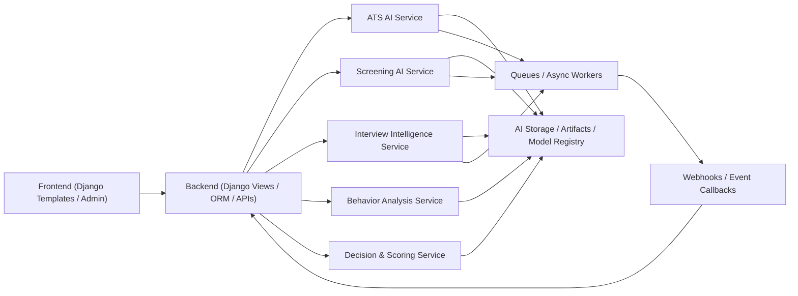

# AI System Architecture Diagram

## Service model

- `ATS AI Service`: resume parsing, section detection, skill extraction, semantic matching, ATS score generation.
- `Screening AI Service`: voice screening, transcript analysis, fit validation, communication scoring.
- `Interview Intelligence Service`: HR interview AI, technical interview AI, machine test AI, transcript summaries.
- `Behavior Analysis Service`: behavioral pattern signals, fairness checks, bias reduction controls.
- `Decision & Scoring Service`: weighted aggregation, explainability, final decision, offer-readiness.

## Sync vs async

- Synchronous:
  - JD normalization
  - resume upload acknowledgement
  - quick ATS parsing previews
- Asynchronous:
  - large-document parsing
  - voice analysis
  - interview transcript processing
  - ranking recalculation for bulk applicants
  - retraining dataset creation

## Communication

- REST APIs for immediate request/response actions
- Queues for heavy or long-running AI tasks
- Webhooks for completion callbacks to backend workflows
- Versioned model registry references in every AI payload

