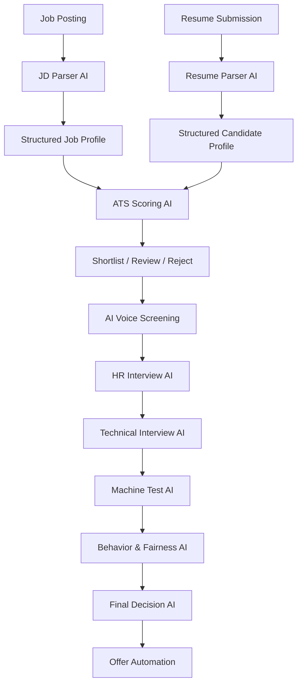

# Hiring Lifecycle Flow Chart

## Stage summary

1. Job posting is converted into a normalized requirement object.
2. Resume submission is converted into a structured candidate object.
3. ATS scoring AI ranks candidates with explainable outputs.
4. Screening AI validates communication, intent, and baseline fit.
5. Interview AI manages HR, technical, and machine-test evaluation.
6. Behavior AI adds fairness-aware behavioral interpretation.
7. Decision AI aggregates signals and triggers offer automation.

