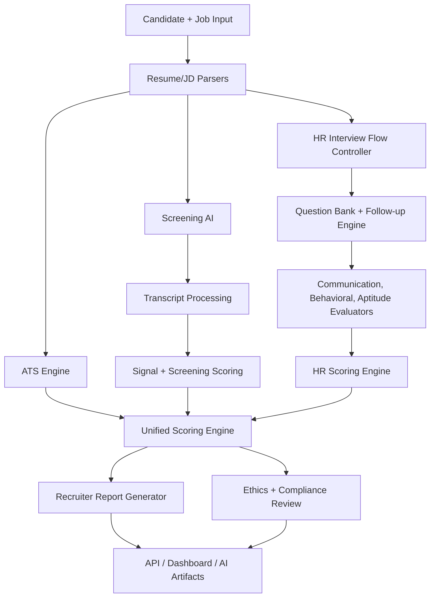

# HR AI Architecture Document

## Overview
The HR AI system evaluates candidates across resume alignment, screening answers, HR interview performance, aptitude logic, simulation stability, unified scoring, and ethics/compliance readiness. The interview module is interactive and stateful; the broader hiring intelligence layer turns the outputs into recruiter-ready scorecards and integration artifacts.

## Architecture Diagram

## Core Components

1. **ATS Engine**: Calculates resume/job fit using skill match, experience relevance, education alignment, and semantic similarity.
2. **Screening AI**: Cleans transcripts, understands candidate answers, scores screening responses, and creates recruiter summaries.
3. **HR Interview Flow Controller**: Manages interview phases: introduction, core HR, role-based evaluation, closing, and completion.
4. **Question Bank Engine**: Generates role-aware and experience-aware HR, aptitude, and situational judgment prompts.
5. **Follow-up Engine**: Stabilizes probing behavior by checking brevity, vagueness, structure, confidence, and concrete answer detail.
6. **Communication Evaluator**: Scores fluency, vocabulary, grammar, clarity, and structure.
7. **Behavioral Evaluator**: Estimates confidence, stress, hesitation, sentiment, and contradiction risk.
8. **Aptitude Evaluator**: Scores logical thinking, problem-solving clarity, and situational judgment.
9. **HR Scoring Engine**: Aggregates turn-level HR scores, clamps anomalies, normalizes weights, and emits explainable averages.
10. **Unified Scoring Engine**: Combines ATS, screening, and HR interview scores into a hiring-fit percentage.
11. **Report Generator**: Produces recruiter-ready structured summaries and natural-language reports.
12. **Ethics Compliance Reviewer**: Validates consent, removes protected demographic signals, adds explainability notes, and applies retention readiness checks.

## Data Flow

1. Candidate resume and job description are parsed into structured profiles.
2. ATS scoring evaluates resume/job alignment.
3. Screening AI processes transcript answers and produces screening scores.
4. HR interview AI asks adaptive questions and evaluates candidate responses.
5. Unified scoring calculates hiring fit using cross-round weights and role adjustments.
6. Report generation produces recruiter summaries, strengths, weaknesses, risk flags, and recommendations.
7. Compliance review checks consent, protected-signal removal, fairness risk, explainability, and retention metadata.
8. API and dashboard layers persist runs, artifacts, candidates, jobs, and interactions.

## Key Modules

- `zecpath_hiring.ai.ats_engine.scoring`
- `zecpath_hiring.ai.screening_ai.scoring`
- `zecpath_hiring.ai.screening_ai.transcript_processing`
- `zecpath_hiring.ai.hr_interview.flow_controller`
- `zecpath_hiring.ai.hr_interview.follow_up_engine`
- `zecpath_hiring.ai.hr_interview.scoring_engine`
- `zecpath_hiring.ai.hr_interview.aptitude_evaluator`
- `zecpath_hiring.ai.hr_interview.report_generator`
- `zecpath_hiring.ai.scoring.unified`
- `zecpath_hiring.ai.ethics.compliance`

## Maintenance Notes

- Keep scoring criteria job-related and auditable.
- Add tests whenever changing thresholds, weights, follow-up rules, or transcript cleanup.
- Store AI outputs in `AIArtifact` with `model_version` for auditability.
- Use compliance review before exposing final recommendations to recruiters.
