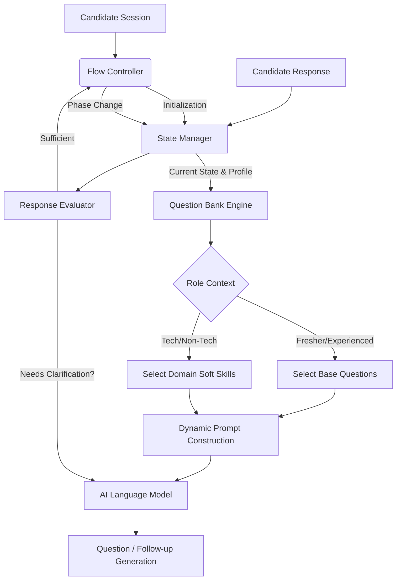

# AI HR Interview Architecture

## Overview
The AI HR Interview System is an interactive, stateful module designed to conduct autonomous behavioral and HR interviews. Unlike the static ATS/Screening pipeline which processes a resume in a single pass, this system engages the candidate in a multi-turn conversation, adapting its questions based on the candidate's profile and real-time responses.

## Architecture Diagram

## Core Components

1. **Flow Controller**: The brain of the interview session. Manages the progression of the interview through its defined phases (Intro -> Core -> Role-based -> Closing).
2. **State Manager**: Maintains the mutable state of the ongoing interview. Tracks the `session_id`, `current_phase`, `asked_questions`, and `candidate_responses`.
3. **Question Bank Engine**: A dynamic repository of question templates and rules. It does not just return static strings; it formulates prompts for the LLM to generate natural, context-aware questions.
4. **Response Evaluator**: Analyzes a candidate's answer in real-time to determine if it meets the criteria of the current question, triggering follow-ups if the answer is too brief or evasive.
