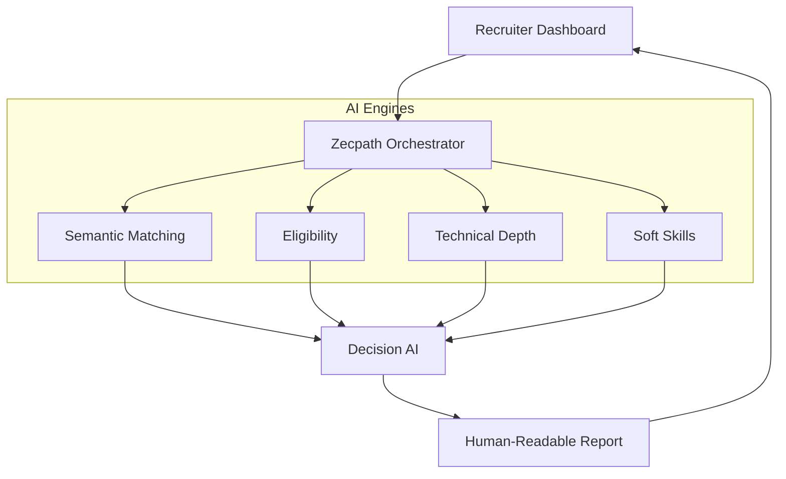

# Zecpath AI Hiring System: Final Presentation Deck

This improved deck incorporates feedback from the internal mock demo, shifting focus to Human-in-the-Loop workflows, Trust & Privacy, and an expanded live demonstration section.

````carousel
# Slide 1: Title Slide
## Zecpath AI Hiring System
**Augmenting Recruiters with Explainable Artificial Intelligence**
*Presented by: [Your Name]*

---
*Presenter Notes: Welcome the audience. Emphasize that Zecpath AI is an augmentation tool designed to empower HR, not replace human intuition.*
<!-- slide -->
# Slide 2: The Hiring Bottleneck
### Why Top Talent Slips Through the Cracks
- **Manual Overload**: Recruiters spend 70% of their time screening resumes, leading to burnout.
- **Subjective Bias**: Implicit bias means highly qualified non-traditional candidates are often ignored.
- **Slow Time-to-Hire**: Delays in scheduling technical interviews cause top candidates to accept competing offers.
- **Shallow Legacy Systems**: Old ATS software uses rigid keyword matching, rejecting great talent just because they used a synonym.
<!-- slide -->
# Slide 3: The Zecpath Solution
### Explainable, Nuanced AI
- **Reads Like a Human**: Understands the *context* of a candidate's experience, not just exact keywords.
- **Simulated Competency**: Conducts an automated behavioral and technical evaluation instantly.
- **Human-in-the-Loop**: The AI doesn't just say "Yes" or "No". It generates a beautifully formatted, explainable Markdown report detailing exactly *Why* a decision was recommended.
<!-- slide -->
# Slide 4: System Architecture (Simplified)
### Parallel Intelligence Processing


*Presenter Notes: Keep this to 45 seconds. Emphasize that the system splits the candidate profile into 4 distinct areas of intelligence, preventing a single point of failure.*
<!-- slide -->
# Slide 5: Trust, Privacy & Fairness
### Enterprise-Grade Security
- **Data Privacy**: Candidate Personally Identifiable Information (PII) is anonymized. Explicit consent timestamps are tracked in the `CandidateProfile` database.
- **Bias Mitigation**: The Behavior AI scores purely on contextual data, ignoring names, gender, and university prestige.
- **Safeguards Against AI Hallucinations**: We use a `Confidence Score` metric. If an external model times out or hallucination risk is high, the system bypasses automation and safely flags the candidate as `HOLD_REVIEW` for a human to step in.
<!-- slide -->
# Slide 6: Business Impact
### Empowering Your HR Team
- **80% Reduction** in manual screening time.
- **Standardized Baselines**: Every candidate receives the exact same rigorous, bias-free technical evaluation.
- **Faster Time to Offer**: Immediate AI processing keeps top candidates engaged.
<!-- slide -->
# Slide 7: Live Demonstration
### Seeing the AI in Action
1. **The Setup**: We are hiring a 'General Dentist'.
2. **The Perfect Match (HIRE)**: Dr. Alice Carter (10 years experience). Notice the detailed *Strengths* in the Markdown report.
3. **The Borderline Case (REVIEW)**: Dr. Bob Miller (Over-specialized Orthodontist). Watch the AI catch this nuance and flag him as a flight risk.
4. **The Underqualified (REJECT)**: Charlie Davis (Dental Assistant). Instantly filtered out, saving the recruiter 15 minutes of manual review.

---
*Presenter Notes: Spend the majority of your remaining time slowly walking through the UI and the generated Intelligence Reports for these candidates.*
<!-- slide -->
# Slide 8: Q&A
### Questions?
*Presenter Notes: Be prepared to answer questions on data retention (purging resumes after 30 days) and how the Semantic ATS handles specific niche medical terminologies.*
````
