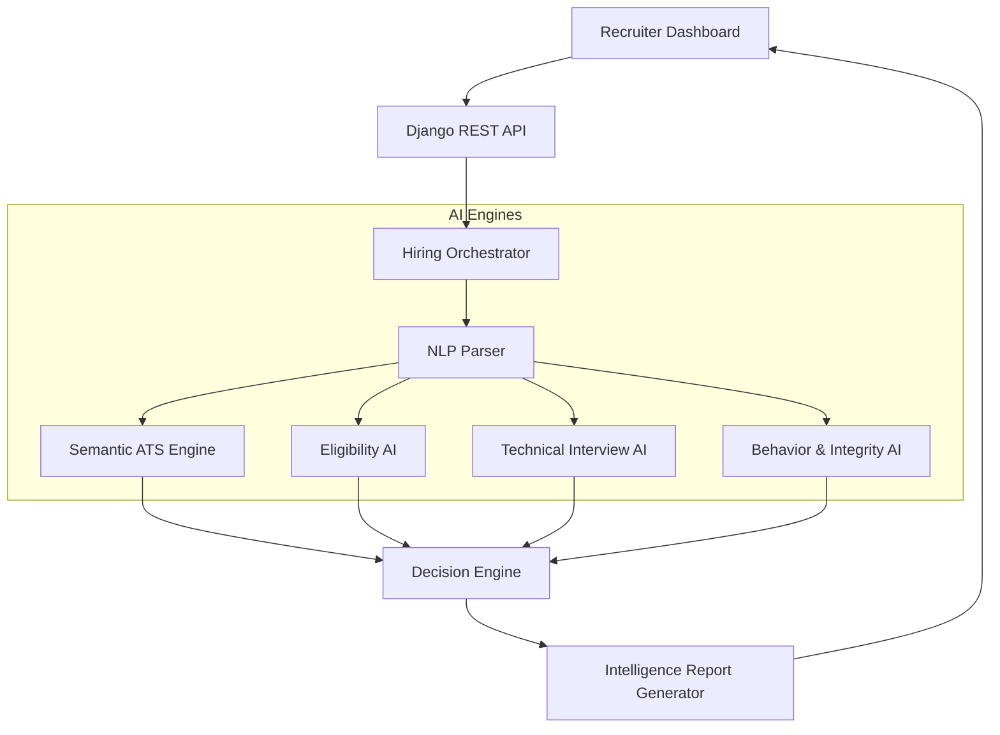
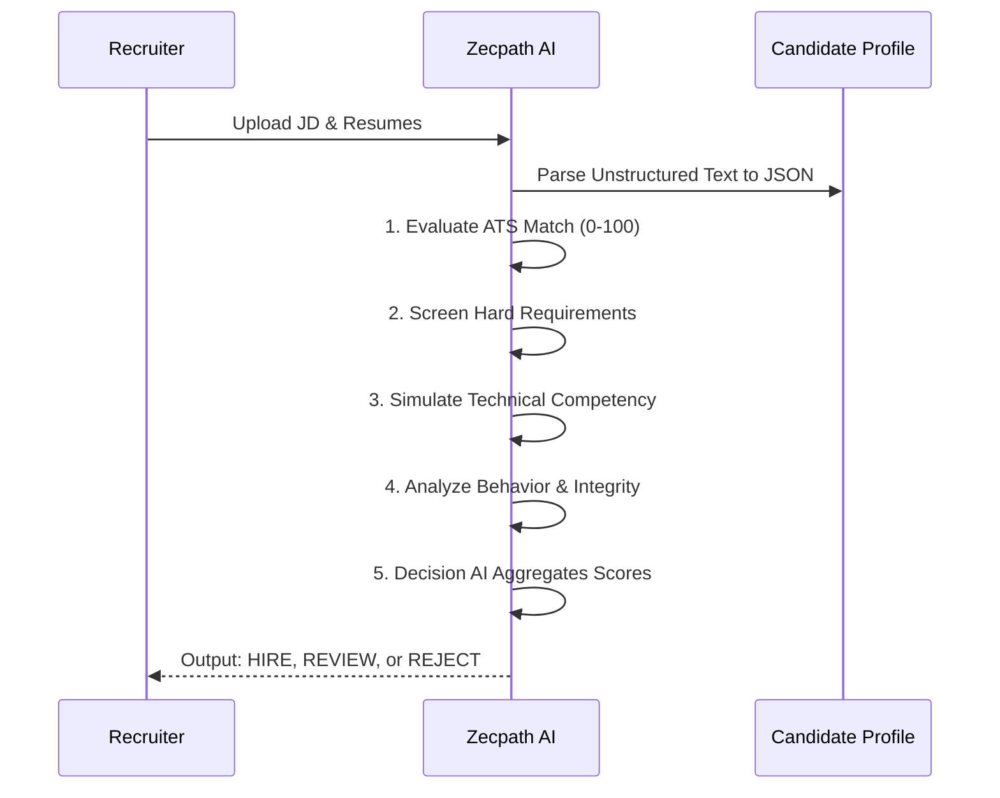

# Zecpath AI Hiring System: Presentation Deck

This document is formatted as a presentation deck. You can use this content to build out your actual slides in PowerPoint, Google Slides, or Keynote.

````carousel
# Slide 1: Title Slide
## Zecpath AI Hiring System
**Revolutionizing Recruitment with End-to-End Artificial Intelligence**
*Presented by: [Your Name]*

---
*Presenter Notes: Welcome the audience. Introduce the Zecpath AI system as the next generation of automated, intelligent recruitment.*
<!-- slide -->
# Slide 2: The Problem
### The Traditional Hiring Bottleneck
- **Manual Overload**: Recruiters spend 70% of their time manually screening hundreds of resumes.
- **Human Bias**: Subjective screening leads to inconsistent candidate evaluation and missed talent.
- **Slow Time-to-Hire**: Delays in technical and behavioral interviews cause top candidates to drop out.
- **Shallow ATS**: Traditional Applicant Tracking Systems only look for exact keywords, missing qualified candidates with diverse backgrounds.
<!-- slide -->
# Slide 3: The Zecpath AI Solution
### A Fully Autonomous Hiring Pipeline
- **Semantic ATS**: Beyond keywords—understands the *context* and *depth* of a candidate's experience.
- **AI-Driven Screening**: Instantly verifies hard constraints (location, degree, minimum experience).
- **Simulated Interviews**: Conducts an automated technical and behavioral competency evaluation before a human ever steps in.
- **Integrity & Fairness**: Built-in malpractice detection and fairness-aware scoring.
<!-- slide -->
# Slide 4: System Architecture
### High-Level AI Infrastructure


*Presenter Notes: Walk through the architecture. Emphasize how the pipeline splits the parsed data into specialized AI models running in parallel, which then feed into a final aggregator (Decision Engine).*
<!-- slide -->
# Slide 5: The Hiring Pipeline Flow
### How a Candidate is Processed


<!-- slide -->
# Slide 6: Deep Dive - AI Modules
- **ATS Engine**: Calculates percentage overlap of skills and infers missing but related skills.
- **Screening AI**: Acts as a strict gatekeeper for mandatory constraints (e.g., "Must have BDS degree").
- **Technical AI**: Assesses depth. A candidate claiming "Root Canal Experience" is evaluated against the complexity required by the job description.
- **Decision Engine**: Resolves conflicts. If an external model times out or fails, the engine safely flags the candidate for `HOLD_REVIEW` rather than unfairly rejecting them.
<!-- slide -->
# Slide 7: Business Impact
### Driving ROI and Efficiency
- **80% Reduction** in manual screening time.
- **Standardized Baselines**: Every candidate receives the exact same rigorous, bias-free technical evaluation.
- **Explainable AI**: The system doesn't just output a score—it generates a readable Markdown report detailing *Why* the candidate succeeded or failed.
- **Scalability**: Process 10 candidates or 10,000 candidates with zero additional HR headcount.
<!-- slide -->
# Slide 8: Live Demonstration
### Demo Flow
1. **The Role**: General Dentist (requires BDS, 2+ years experience).
2. **The Perfect Match**: Watch the AI evaluate Dr. Alice Carter (10 years experience) and issue a **HIRE**.
3. **The Borderline Case**: Watch the AI flag Dr. Bob Miller (Over-specialized Orthodontist) for **REVIEW**.
4. **The Underqualified**: Watch the AI quickly filter out an inexperienced dental assistant with a **REJECT**.
5. **The Explainable Output**: Review the final generated Markdown report.

---
*Presenter Notes: Transition smoothly to your live screen share here.*
````
