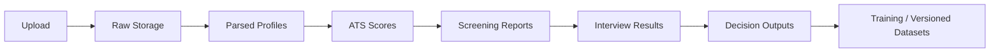

# Storage Structure Documentation and Metadata Standards

## Data flow

## Storage formats

- `resumes/raw/`: source PDF, DOCX, TXT
- `profiles/candidates/`: parsed candidate JSON
- `profiles/jobs/`: parsed job JSON
- `scores/ats/`: ATS scorecards and shortlist explanations
- `screening/`: transcript summaries and screening scores
- `interviews/`: HR, technical, machine-test outputs
- `decisions/`: final recommendations and offer triggers
- `datasets/`: curated training and retraining snapshots

## Metadata standards

- `candidate_id`
- `job_id`
- `application_id`
- `artifact_type`
- `model_name`
- `model_version`
- `pipeline_stage`
- `created_at`
- `updated_at`
- `requested_by`
- `correlation_id`

## Versioning rules

- Every artifact stores the model version that produced it.
- Parsed profiles are immutable snapshots once used for a scoring decision.
- Retraining data is exported into versioned dataset batches.
- Async jobs publish a correlation ID for webhook reconciliation.

## Retention and consent metadata

Every candidate-facing AI workflow should store consent and retention metadata with the generated artifacts:

- `ai_screening_consent`
- `transcript_processing_consent`
- `automated_scoring_notice`
- `data_retention_notice`
- `retention_days`
- `delete_after`
- `protected_signal_reviewed`
- `explainability_available`

Default retention windows:

- raw resume: 180 days
- transcript: 90 days
- scorecard: 365 days
- audit log: 730 days
- training snapshot: 365 days

