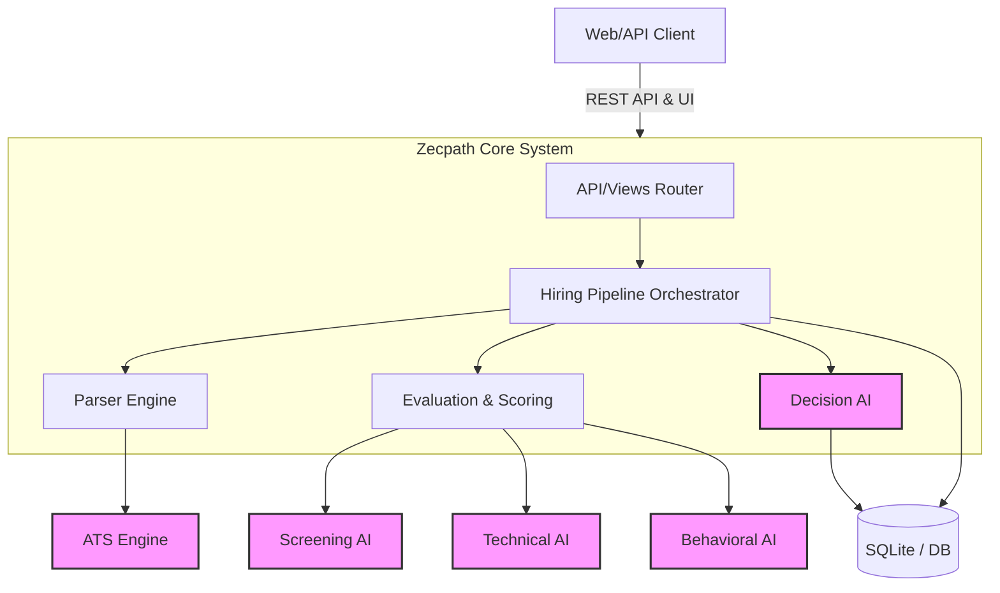

# Zecpath AI System Architecture

## 1. System Overview
The **Zecpath AI Hiring System** is an advanced, automated recruitment platform. It leverages state-of-the-art Natural Language Processing (NLP) to parse resumes, evaluate candidates against job requirements, conduct AI-driven interviews, and make comprehensive hiring decisions.

The platform is designed as a **Django-based monolith** with specialized AI micro-engines operating within the backend to ensure data integrity, speed, and deep integration.

## 2. High-Level Architecture

## 3. Core Components

### 3.1 Web Application & API Layer (`zecpath_hiring.apps`)
- **Django Core**: Manages models, serializers, and core API endpoints.
- **REST Framework**: Provides secure `api/v1/runs/` endpoints for programmatic ingestion.
- **Dashboard UI**: Renders templates (`dashboard_home`, `results`) for human recruiters to manage candidates and view generated reports.

### 3.2 AI Engine Layer (`zecpath_hiring.ai`)
The intelligence of Zecpath AI is isolated into distinct domains:
- **Parsers (`ai.parsers`)**: Converts unstructured text (PDFs, docs, raw text) into standardized JSON profiles using NLP.
- **ATS Engine (`ai.ats_engine`)**: Performs deterministic and semantic matching of candidate skills against job requirements.
- **Screening AI (`ai.screening_ai`)**: Assesses core eligibility criteria (e.g., location, minimum experience, education bounds).
- **Technical/Machine Test AI (`ai.machine_test`)**: Evaluates practical coding assignments, generating scores for correctness, style, and efficiency.
- **Behavioral & HR AI (`ai.behavior_ai`, `ai.hr_interview`)**: Analyzes soft skills, sentiment, cultural fit, and simulates HR screening workflows.
- **Decision AI (`ai.decision_ai`)**: The final aggregator. It takes the output of all evaluation engines, resolves conflicts, applies threshold logic, and outputs the final `HIRE`, `REVIEW`, or `REJECT` status along with a detailed explanation.

### 3.3 Data Models
- `JobProfile`: Stores the raw and structured schemas of a job requirement.
- `CandidateProfile`: Stores personal info, raw resume strings, and parsed JSON structures. Also handles PII constraints.
- `HiringRun`: Represents a complete cycle of a candidate applying to a job. Contains final scores from all sub-engines.
- `AIArtifact`: An immutable, auditable log of AI payloads, prompt requests, and model decisions for explainability.
- `AIAuditLog` / `AIMetric`: Tracks observability metrics (latency, model accuracy, errors).

## 4. Data Flow & Pipeline Execution

1. **Ingestion**: Resume and JD arrive via API or upload.
2. **Parsing**: `resume_parser` and `jd_parser` generate structured dicts.
3. **Multi-Engine Evaluation (Parallel/Sequential)**:
   - ATS compares skills.
   - Screening AI verifies eligibility.
   - Technical AI assesses capabilities.
   - Behavior AI checks soft skills.
4. **Aggregation**: The `Decision AI` compiles a final candidate vector.
5. **Report Generation**: `report_generator` builds human-readable explanations.
6. **Storage**: Outputs saved to `HiringRun` and `AIArtifact`.
7. **Response**: JSON response or dashboard view returned to the recruiter.
